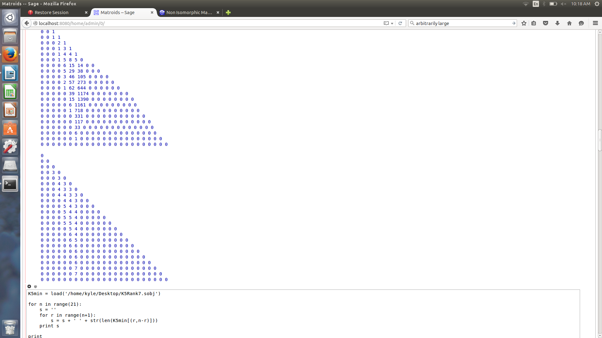
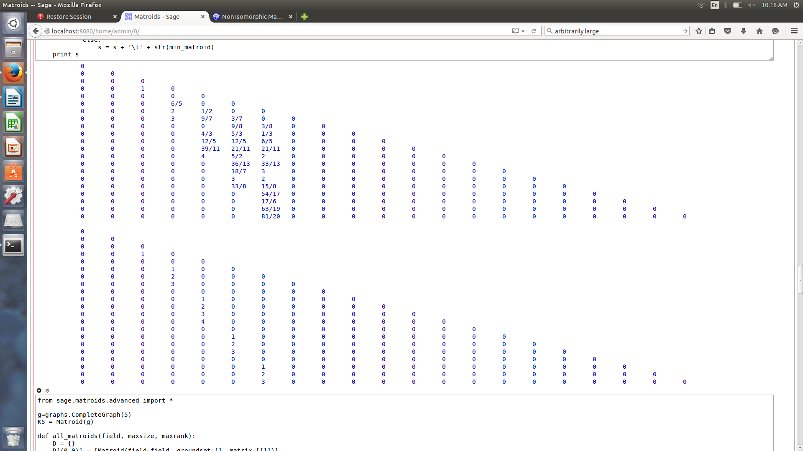

# Bounding the Sizes of Binary Matroids with Respect to Rank

Sage code accompanying a research project on bounding the number of elements of a binary matroid as a function of its rank, subject to excluding certain matroid minors.

## Authors

- Kyle Booker
- Rachael Lobay
- Cory Langille
- Sean McGuinness

## Contents

- [Background](#background)
- [Repository layout](#repository-layout)
- [Requirements](#requirements)
- [Getting started](#getting-started)
- [Scripts](#scripts)
- [Sample output](#sample-output)
- [Paper](#paper)
- [Notes and limitations](#notes-and-limitations)
- [License](#license)

## Background

For a simple binary matroid `M`, it has been conjectured that the maximum number of elements of `M` is at most `(9/2) r(M)`, where `r(M)` is the rank of `M`. Following the approach of Kung et al., we examine small-rank cases computationally and use the results to seed an inductive proof of size bounds. The excluded minor of primary interest here is `M(K_5)`, the cycle matroid of the complete graph on five vertices.

## Repository layout

```
binary-matroids/
├── src/                       # Sage source for the enumeration and analyses
│   ├── all_matroids.sage      # main enumeration: K5-minor-free binary matroids
│   ├── circumference.sage     # minimum circumference per (rank, size)
│   └── triangle_number.sage   # maximum triangle count per (rank, size)
├── data/                      # precomputed Sage objects (.sobj) for fast reload
├── docs/                      # paper and figures
│   ├── binary-matroids-without-k5-minor.pdf
│   ├── circumference.png
│   └── matroid-triangle.png
├── LICENSE
└── README.md
```

## Requirements

- [SageMath](https://www.sagemath.org/) 8.x (Python 2 era). The scripts use `print s`-style statements, so they will not run unmodified on Sage 9.0+. Porting to Python 3 is a small change (`print(s)`) if desired.
- Run locally rather than on the SageMath Cell Server — the enumeration in `all_matroids.sage` can take a long time at higher ranks/sizes.

## Getting started

Clone the repository and launch Sage from its root:

```bash
git clone git@github.com:KyleBooker/binary-matroids.git
cd binary-matroids
sage
```

Inside the Sage REPL, run the main enumeration:

```python
sage: load("src/all_matroids.sage")
```

This populates the dictionary `K5min`, keyed by `(r, k)` where `r` is the rank and `k = n - r` (so `n` is the total number of elements). For example, all rank-4 matroids with 9 elements live at `K5min[(4, 5)]`. Partial progress is written to `Test.sobj` after each step, so the run is resumable.

Once `K5min` is in scope you can run the analyses:

```python
sage: load("src/circumference.sage")
sage: load("src/triangle_number.sage")
```

To reuse a previous run instead of re-enumerating, load one of the precomputed objects from `data/`:

```python
sage: K5min = load("data/all_matroids.sobj")
```

## Scripts

### `src/all_matroids.sage` — `all_matroids(field, maxsize, maxrank)`

Enumerates simple matroids over `field` of bounded size and rank, discarding any matroid that contains `K_5` as a minor. Builds the family inductively via single-element linear extensions and coextensions, deduplicating up to field isomorphism. For binary matroids, pass `GF(2)`. The excluded minor is set once at the top of the file and can be replaced by any matroid.

### `src/circumference.sage`

Walks `K5min` and prints a triangular table of the *minimum* circumference (size of the largest circuit) across the family at each `(r, n - r)`.

### `src/triangle_number.sage`

Walks `K5min` and prints a triangular table of the *maximum* number of 3-element circuits (triangles) found across the family at each `(r, n - r)`.

## Sample output

Minimum circumference, plotted across rank/size:



Triangle counts, plotted across rank/size:



## Paper

The accompanying write-up is available in [docs/](docs/binary-matroids-without-k5-minor.pdf). It walks through the bounding argument in detail and contextualizes the computational results.

## Notes and limitations

- This code was written for research, not as a reusable library — it has not been modularized for general use, and some scripts assume globals (`K5min`) are already in scope.
- The enumeration is exponential in size/rank; running `all_matroids(GF(2), 30, 30)` to completion is not practical without significant compute.
- Targets Sage 8.x / Python 2. Porting to modern Sage is straightforward but has not been done.

## License

Released under the [MIT License](LICENSE).
